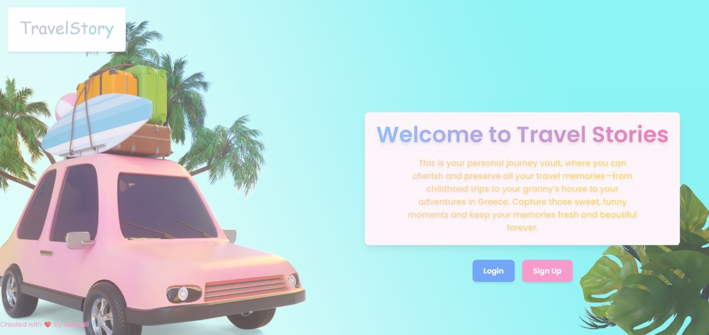

### 🏞️ Travel Story Website  

#### 🌍 Share Your Adventures with the World!  

Welcome to **Travel Story**, a web platform where travelers can document, share, and explore captivating travel experiences. Whether it's a breathtaking mountain trek, a serene beach escape, or an urban adventure, this platform helps you relive and showcase your journeys with others.  


## 🚀 Features  

✔️ **User-Friendly Interface** – Easily add, edit, and delete travel stories.  
✔️ **Image Upload** – Share stunning visuals of your journey.  
✔️ **Date-Based Filtering** – Find stories by selecting a specific date range.  
✔️ **Dynamic Story Display** – Stories are presented beautifully with text and images.  
✔️ **Fully Responsive** – Works seamlessly across all devices.  


## 🛠️ Tech Stack  

- **Frontend:** React.js, Tailwind CSS  
- **Backend:** Node.js, Express.js  
- **Database:** MongoDB    
- **Authentication:** JWT (if implemented)  


## 📸 Screenshots  



## 🔧 Setup Instructions  

### 1️⃣ Clone the Repository  
```bash
git clone https://github.com/deepalikonety/travel-story-website.git
cd travel-story-website
```

### 2️⃣ Install Dependencies  
```bash
npm install  # Install frontend dependencies
cd backend && npm install  # Install backend dependencies
```

### 3️⃣ Start the Development Server  
```bash
# Start backend
cd backend
node server.js  

# Start frontend (in another terminal)
cd frontend
npm start
```

### 4️⃣ Open in Browser  
Go to `http://localhost:3000/` to see your project live!  

---

## 💡 Future Enhancements  
🔹 **Like & Comment System** – Engage with fellow travelers.  
🔹 **Interactive Maps** – Pin locations for better visualization.  

---

## 🙌 Contributing  

Want to improve **Travel Story**? Contributions are welcome! Fork the repository, make changes, and submit a pull request.  

---

## 📬 Contact  

**Deepali Konety**  
📧 deepalikonety@gmail.com  

